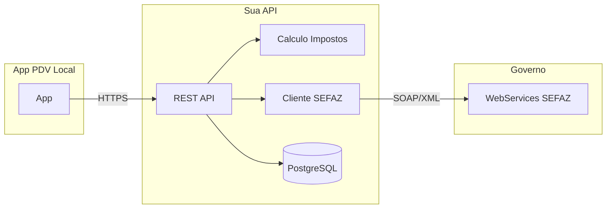

# API de Notas Fiscais Eletrônicas para PDV (Node.js + TypeScript)

## Contexto

- **Repositório atual**: vazio — API será criada do zero.
- **Papel da API**: ponte entre o app PDV local e a SEFAZ; recebe/envia dados de NF-e/NFC-e e persiste tudo em banco na nuvem.
- **Stack**: Node.js + TypeScript. Host: máquina local (testes) → Railway (futuro).

---

## 1. Escopo e decisões iniciais

Antes de implementar, vale definir:


| Decisão                 | Opções                                              | Recomendação                                                               |
| ----------------------- | --------------------------------------------------- | -------------------------------------------------------------------------- |
| **Tipo de nota**        | NFC-e (cupom, típico PDV) e/ou NF-e (nota completa) | Começar com **NFC-e** (modelo 65); NF-e (55) depois se precisar.           |
| **Banco de dados**      | PostgreSQL, MySQL, MongoDB                          | **PostgreSQL** (ótimo no Railway, relacional para notas/itens/eventos).    |
| **Estado(s)**           | Um estado primeiro ou SVRS (vários)                 | Um estado (ex.: SP) ou **SVRS** (RS) para testes multi-estado.             |
| **Certificado digital** | A1 (arquivo .pfx) ou A3 (token/cartão)              | A1 é mais simples para servidor; API precisará do .pfx em ambiente seguro. |


O plano abaixo assume: **NFC-e**, **PostgreSQL**, e uso de **certificado A1** em arquivo (variável de ambiente ou volume).

---

## 2. Arquitetura geral




- **App** envia payload da venda (itens, cliente opcional, etc.); **API** calcula impostos, monta XML, chama SEFAZ, grava no banco e devolve chave/protocolo/PDF (se disponível).
- Consultas, cancelamentos e inutilização de numeração também passam pela API e são persistidos.

---

## 3. Estrutura do projeto (Node.js + TypeScript)

Estrutura sugerida na raiz do repositório (monorepo ou só API):

```
pdv_cloud_teste/
├── package.json
├── tsconfig.json
├── .env.example
├── src/
│   ├── index.ts              # Entry: Express/Fastify, middlewares, rotas
│   ├── config/
│   │   ├── env.ts             # Variáveis de ambiente
│   │   └── database.ts       # Cliente DB (ex: pg ou Prisma)
│   ├── routes/
│   │   ├── nfce.ts           # POST emitir, GET consultar, POST cancelar, etc.
│   │   └── health.ts         # Health check (API + SEFAZ opcional)
│   ├── services/
│   │   ├── taxCalculator.ts  # ICMS, PIS, COFINS (regime: Simples/Regime Normal)
│   │   ├── nfceService.ts   # Orquestra: montagem XML, chamada SEFAZ, persistência
│   │   └── certificate.ts   # Leitura e uso do certificado A1 (.pfx)
│   ├── integrations/
│   │   └── sefaz/
│   │       ├── client.ts     # Chamadas SOAP aos webservices (por estado/SVRS)
│   │       └── urls.ts       # URLs homologação/produção por UF
│   ├── db/
│   │   ├── schema.sql        # Ou migrations (Prisma/Knex)
│   │   ├── repositories/
│   │   │   ├── empresa.ts    # Dados do emitente (CNPJ, IE, certificado ref)
│   │   │   ├── nfce.ts       # Cabeçalho da NFC-e
│   │   │   └── eventos.ts    # Cancelamentos, CCe, etc.
│   │   └── index.ts
│   └── types/
│       └── nfce.ts           # DTOs e tipos da NFC-e
├── tests/
│   └── ...
└── README.md
```

- **Framework HTTP**: Express ou Fastify (Fastify é performático e com tipagem boa em TS).
- **Validação**: Zod ou similar para validar body das rotas (itens, CNPJ, etc.).
- **Ambiente**: `NODE_ENV`, `DATABASE_URL`, `SEFAZ_AMBIENTE=homologacao|producao`, `CERTIFICADO_PFX_BASE64` ou `CERTIFICADO_PATH` + senha em env.

---

## 4. Integração com a SEFAZ (API do governo)

- **WebServices**: SOAP/XML; URLs diferentes por UF e ambiente (homologação/produção). Ex.: SP NFC-e v4: `homologacao.nfce.fazenda.sp.gov.br`, etc. Manter um mapa em `integrations/sefaz/urls.ts` (por UF e por serviço: Autorizacao4, RetAutorizacao4, ConsultaProtocolo4, StatusServico4).
- **Biblioteca**: Usar uma lib que já fale SOAP com SEFAZ e assine XML com certificado A1, por exemplo:
  - **[@nfewizard-io/nfce](https://github.com/nfewizard-org/nfewizard-io)** (TypeScript, NFC-e/NF-e, requer JDK para validação de schema por padrão; dá para usar validação JS).
  - Ou implementar cliente SOAP + assinatura (node-forge ou `node-grpc` não; usar `node-forge` + `soap` ou lib que já encapsule assinatura).
- **Certificado**: Carregar .pfx (path ou base64) + senha; usar em todas as chamadas que exigem assinatura (autorização, cancelamento, inutilização). Nunca commitar .pfx; apenas env vars ou volume no servidor.
- **Fluxo típico**: Montar `nfeDadosMsg` (XML da NFC-e), assinar, enviar em NFeAutorizacao4; em seguida NFeRetAutorizacao4 para buscar protocolo; persistir chave + protocolo + XML no banco.

---

## 5. Cálculo de impostos

- **Tributos principais**: ICMS (estadual), PIS e COFINS (federais). Para NFC-e de varejo, regime mais comum é **Simples Nacional**.
- **Simples Nacional**: Alíquotas e faixas dependem da RBT12 (receita bruta últimos 12 meses); há sublimites estaduais e federal. Opções:
  - **Regra fixa por empresa**: Você guarda na base (ex.: tabela `empresa`) a alíquota efetiva ou faixa; o módulo `taxCalculator` aplica sobre a base de cálculo (valor dos itens, descontos, etc.).
  - **Regra por item**: CFOP, CST, alíquota por produto (NCM opcional); útil para regime normal ou quando houver mix Simples/outros.
- **Implementação sugerida**: Serviço `taxCalculator` com funções como `calcularICMS(item, empresa)`, `calcularPIS(item, empresa)`, `calcularCOFINS(item, empresa)`; entrada: valor, NCM/CST quando houver; saída: valores e bases para preencher as tags da NFC-e. Manter alíquotas e faixas em config ou tabela para não hardcodar lei (facilita ajustes futuros).

---

## 6. Persistência (PostgreSQL)

- **Tabelas sugeridas** (podem ser criadas via migrations ou `schema.sql`):
  - **empresa**: id, cnpj, razao_social, nome_fantasia, ie, uf, endereco, certificado_ref (ex.: qual certificado usar), regime_tributario, alíquotas/faixa (ou JSON), criado_em, ativo.
  - **nfce**: id, id_empresa, chave, numero, serie, status (autorizada, cancelada, rejeitada, etc.), protocolo, xml_enviado, xml_retorno (ou só chave + protocolo e guardar XML em blob/storage), valor_total, criado_em, ambiente (homolog/prod).
  - **nfce_itens**: id, id_nfce, numero_item, descricao, ncm, cfop, quantidade, valor_unitario, valor_total, icms_*, pis_*, cofins_* (conforme necessário).
  - **nfce_eventos**: id, id_nfce, tipo (cancelamento, cce), sequencia, xml_evento, protocolo, criado_em.
  - **numeracao**: id_empresa, serie, ultimo_numero, ano (controle de inutilização e próximo número).
- **ORM**: Prisma ou Drizzle (TypeScript nativo) para tipagem e migrations; ou SQL puro com `pg` se preferir menos abstração.

---

## 7. Endpoints da API (contrato com o app)

- `POST /nfce/emitir` — Body: id_empresa (ou token identifica), itens, forma_pagamento, desconto, cliente (opcional). Resposta: chave, protocolo, numero, serie, status, link PDF se houver.
- `GET /nfce/:chave` — Consulta por chave; retorna status e dados persistidos (e pode reconsultar SEFAZ se quiser).
- `POST /nfce/:chave/cancelar` — Body: justificativa. Chama SEFAZ e grava evento.
- `GET /nfce?empresa=...&data_inicio=...&data_fim=...` — Listagem paginada para o app.
- `POST /nfce/inutilizar` — Body: serie, numero_inicial, numero_final, justificativa. Para inutilizar faixa de números.
- `GET /health` — 200 + status do DB (e opcionalmente status do SEFAZ em homologação).

Autenticação: definir se o app usará API key (header) ou JWT; em qualquer caso, associar requisições a uma `empresa` (ou tenant) para multi-loja no futuro.

---

## 8. Ambiente e deploy

- **Local**: `npm run dev` (ts-node-dev ou tsx); `.env` com `DATABASE_URL` (Postgres local ou Docker), `SEFAZ_AMBIENTE=homologacao`, certificado em path ou base64.
- **Railway**: Mesma imagem/comando; variáveis no painel (DATABASE_URL fornecido pelo Railway Postgres, certificado em env base64 ou via volume/secrets). Usar `SEFAZ_AMBIENTE=producao` apenas quando certificado e cadastro estiverem em produção.

---

## 9. Ordem sugerida de implementação

1. **Scaffold**: package.json (Node 18+), TypeScript, ESLint, estrutura de pastas acima.
2. **Config e DB**: Variáveis de ambiente, conexão PostgreSQL, schema/migrations e repositórios mínimos (empresa, nfce).
3. **Health**: Rota `GET /health` e checagem do banco.
4. **Módulo de impostos**: `taxCalculator` com Simples Nacional (pelo menos um CST/CFOP padrão) e testes unitários.
5. **Certificado e SEFAZ**: Carregar A1; cliente SOAP (ou lib) para um estado (ex.: SVRS ou SP); StatusServico4 para testar conectividade.
6. **Emitir NFC-e**: Montagem do XML (ou uso da lib), assinatura, Autorizacao4 + RetAutorizacao4, gravação em `nfce` e `nfce_itens`.
7. **Consultar e cancelar**: Endpoints e persistência de eventos.
8. **Listagem e inutilização**: Conforme necessidade do app.
9. **README**: Como rodar local, variáveis obrigatórias, e como conectar o app PDV à API.

---

## 10. Riscos e cuidados

- **Certificado**: Prazo de validade; renovar antes de vencer e atualizar na API.
- **SEFAZ**: Homologação tem limites e dados de teste; não usar produção sem certificado e cadastro válidos.
- **Dados sensíveis**: Não logar XML completo com dados pessoais; não expor certificado em logs.
- **Concorrência**: Numeração da NFC-e por série/empresa deve ser atômica (transaction ou lock) para evitar duplicidade ou inutilização desnecessária.

Se quiser, na implementação podemos detalhar primeiro um único estado (ex.: SP ou SVRS) e um único regime (Simples Nacional) e depois generalizar UF e regimes.