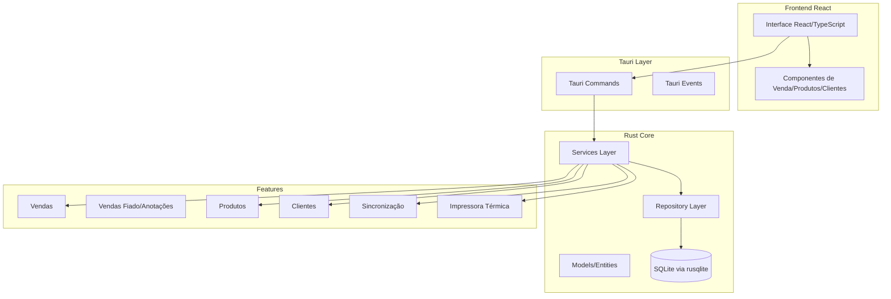
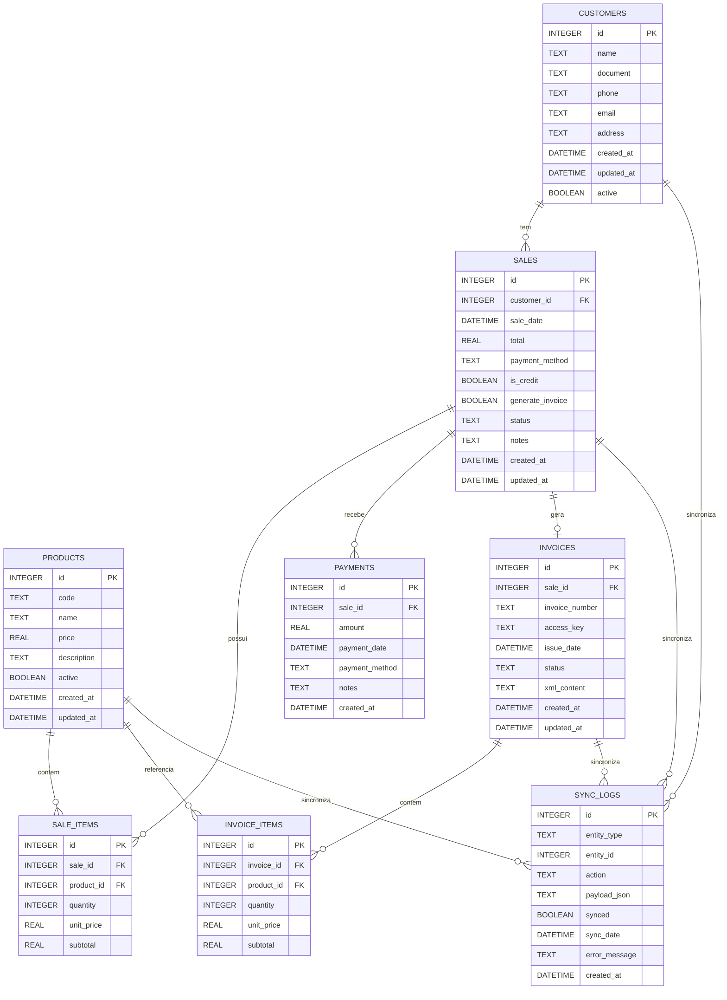

# Plano de Desenvolvimento - PDV Desktop (Rust/Tauri)

## Visão Geral

Desenvolver um sistema PDV desktop usando Tauri (Rust + React) com SQLite local, focado inicialmente no desktop antes da integração com a API cloud. O estoque será simplificado (apenas verificação de existência do produto, sem controle de quantidade).

## Arquitetura



## Modelagem do Banco de Dados

### Diagrama Entidade-Relacionamento



### Schema SQL Completo

```sql
-- Tabela de Clientes
CREATE TABLE customers (
    id INTEGER PRIMARY KEY AUTOINCREMENT,
    name TEXT NOT NULL,
    document TEXT UNIQUE, -- CPF/CNPJ
    phone TEXT,
    email TEXT,
    address TEXT,
    active BOOLEAN DEFAULT 1,
    created_at DATETIME DEFAULT CURRENT_TIMESTAMP,
    updated_at DATETIME DEFAULT CURRENT_TIMESTAMP
);

-- Tabela de Produtos
CREATE TABLE products (
    id INTEGER PRIMARY KEY AUTOINCREMENT,
    code TEXT UNIQUE NOT NULL, -- Código de barras ou código interno
    name TEXT NOT NULL,
    price REAL NOT NULL CHECK(price >= 0),
    description TEXT,
    active BOOLEAN DEFAULT 1,
    created_at DATETIME DEFAULT CURRENT_TIMESTAMP,
    updated_at DATETIME DEFAULT CURRENT_TIMESTAMP
);

-- Tabela de Vendas
CREATE TABLE sales (
    id INTEGER PRIMARY KEY AUTOINCREMENT,
    customer_id INTEGER,
    sale_date DATETIME NOT NULL DEFAULT CURRENT_TIMESTAMP,
    total REAL NOT NULL CHECK(total >= 0),
    payment_method TEXT NOT NULL, -- 'dinheiro', 'cartao_credito', 'cartao_debito', 'pix', 'fiado'
    is_credit BOOLEAN DEFAULT 0, -- Indica se é venda fiado
    generate_invoice BOOLEAN DEFAULT 1, -- Se deve gerar nota fiscal
    status TEXT NOT NULL DEFAULT 'completed', -- 'completed', 'pending', 'cancelled'
    notes TEXT, -- Observações da venda
    created_at DATETIME DEFAULT CURRENT_TIMESTAMP,
    updated_at DATETIME DEFAULT CURRENT_TIMESTAMP,
    FOREIGN KEY (customer_id) REFERENCES customers(id) ON DELETE SET NULL
);

-- Tabela de Itens de Venda
CREATE TABLE sale_items (
    id INTEGER PRIMARY KEY AUTOINCREMENT,
    sale_id INTEGER NOT NULL,
    product_id INTEGER NOT NULL,
    quantity INTEGER NOT NULL CHECK(quantity > 0),
    unit_price REAL NOT NULL CHECK(unit_price >= 0),
    subtotal REAL NOT NULL CHECK(subtotal >= 0),
    FOREIGN KEY (sale_id) REFERENCES sales(id) ON DELETE CASCADE,
    FOREIGN KEY (product_id) REFERENCES products(id) ON DELETE RESTRICT
);

-- Tabela de Pagamentos (para vendas fiado)
CREATE TABLE payments (
    id INTEGER PRIMARY KEY AUTOINCREMENT,
    sale_id INTEGER NOT NULL,
    amount REAL NOT NULL CHECK(amount > 0),
    payment_date DATETIME NOT NULL DEFAULT CURRENT_TIMESTAMP,
    payment_method TEXT NOT NULL, -- 'dinheiro', 'cartao_credito', 'pix', etc
    notes TEXT,
    created_at DATETIME DEFAULT CURRENT_TIMESTAMP,
    FOREIGN KEY (sale_id) REFERENCES sales(id) ON DELETE CASCADE
);

-- Tabela de Notas Fiscais
CREATE TABLE invoices (
    id INTEGER PRIMARY KEY AUTOINCREMENT,
    sale_id INTEGER NOT NULL,
    invoice_number TEXT UNIQUE, -- Número da NF-e
    access_key TEXT UNIQUE, -- Chave de acesso da NF-e
    issue_date DATETIME NOT NULL,
    status TEXT NOT NULL DEFAULT 'pending', -- 'pending', 'issued', 'cancelled', 'error'
    xml_content TEXT, -- XML da nota fiscal (opcional, pode ser armazenado separadamente)
    created_at DATETIME DEFAULT CURRENT_TIMESTAMP,
    updated_at DATETIME DEFAULT CURRENT_TIMESTAMP,
    FOREIGN KEY (sale_id) REFERENCES sales(id) ON DELETE CASCADE
);

-- Tabela de Itens da Nota Fiscal
CREATE TABLE invoice_items (
    id INTEGER PRIMARY KEY AUTOINCREMENT,
    invoice_id INTEGER NOT NULL,
    product_id INTEGER NOT NULL,
    quantity INTEGER NOT NULL CHECK(quantity > 0),
    unit_price REAL NOT NULL CHECK(unit_price >= 0),
    subtotal REAL NOT NULL CHECK(subtotal >= 0),
    FOREIGN KEY (invoice_id) REFERENCES invoices(id) ON DELETE CASCADE,
    FOREIGN KEY (product_id) REFERENCES products(id) ON DELETE RESTRICT
);

-- Tabela de Logs de Sincronização
CREATE TABLE sync_logs (
    id INTEGER PRIMARY KEY AUTOINCREMENT,
    entity_type TEXT NOT NULL, -- 'sale', 'customer', 'product', 'invoice'
    entity_id INTEGER NOT NULL,
    action TEXT NOT NULL, -- 'create', 'update', 'delete'
    payload_json TEXT, -- JSON com dados para sincronização
    synced BOOLEAN DEFAULT 0,
    sync_date DATETIME,
    error_message TEXT,
    created_at DATETIME DEFAULT CURRENT_TIMESTAMP
);

-- Índices para melhor performance
CREATE INDEX idx_sales_customer_id ON sales(customer_id);
CREATE INDEX idx_sales_date ON sales(sale_date);
CREATE INDEX idx_sales_status ON sales(status);
CREATE INDEX idx_sales_is_credit ON sales(is_credit);
CREATE INDEX idx_sale_items_sale_id ON sale_items(sale_id);
CREATE INDEX idx_sale_items_product_id ON sale_items(product_id);
CREATE INDEX idx_payments_sale_id ON payments(sale_id);
CREATE INDEX idx_payments_date ON payments(payment_date);
CREATE INDEX idx_invoices_sale_id ON invoices(sale_id);
CREATE INDEX idx_invoices_status ON invoices(status);
CREATE INDEX idx_invoice_items_invoice_id ON invoice_items(invoice_id);
CREATE INDEX idx_sync_logs_entity ON sync_logs(entity_type, entity_id);
CREATE INDEX idx_sync_logs_synced ON sync_logs(synced);
CREATE INDEX idx_customers_document ON customers(document);
CREATE INDEX idx_products_code ON products(code);
CREATE INDEX idx_products_active ON products(active);

-- Trigger para atualizar updated_at automaticamente
CREATE TRIGGER update_customers_timestamp 
    AFTER UPDATE ON customers
    BEGIN
        UPDATE customers SET updated_at = CURRENT_TIMESTAMP WHERE id = NEW.id;
    END;

CREATE TRIGGER update_products_timestamp 
    AFTER UPDATE ON products
    BEGIN
        UPDATE products SET updated_at = CURRENT_TIMESTAMP WHERE id = NEW.id;
    END;

CREATE TRIGGER update_sales_timestamp 
    AFTER UPDATE ON sales
    BEGIN
        UPDATE sales SET updated_at = CURRENT_TIMESTAMP WHERE id = NEW.id;
    END;

CREATE TRIGGER update_invoices_timestamp 
    AFTER UPDATE ON invoices
    BEGIN
        UPDATE invoices SET updated_at = CURRENT_TIMESTAMP WHERE id = NEW.id;
    END;
```

### Relacionamentos e Constraints

1. **Customers → Sales**: Um cliente pode ter múltiplas vendas (1:N)
2. **Sales → Sale Items**: Uma venda pode ter múltiplos itens (1:N)
3. **Products → Sale Items**: Um produto pode estar em múltiplas vendas (1:N)
4. **Sales → Payments**: Uma venda fiado pode ter múltiplos pagamentos (1:N)
5. **Sales → Invoices**: Uma venda pode gerar uma nota fiscal (1:1, opcional)
6. **Invoices → Invoice Items**: Uma nota fiscal tem múltiplos itens (1:N)

### Regras de Integridade

- **Vendas fiado**: `is_credit = 1` implica `generate_invoice = 0` (não gera NF)
- **Status de pagamento**: Calculado pela soma de `payments.amount` vs `sales.total`
- **Sincronização**: Apenas vendas com `generate_invoice = 1` e `is_credit = 0` devem sincronizar para NF
- **Soft delete**: Usar campo `active` em vez de deletar registros fisicamente

## Estrutura de Diretórios

```
 pdv_teste/
├── src-tauri/              # Código Rust/Tauri
│   ├── src/
│   │   ├── main.rs         # Entry point Tauri
│   │   ├── lib.rs          # Biblioteca principal
│   │   ├── commands/       # Tauri commands (exposição para frontend)
│   │   ├── models/         # Entidades de domínio
│   │   ├── repositories/   # Acesso a dados (SQLite)
│   │   ├── services/       # Lógica de negócio
│   │   ├── database/       # Setup e migrations SQLite
│   │   ├── sync/           # Lógica de sincronização
│   │   └── printer/        # Integração com impressora térmica
│   ├── Cargo.toml
│   └── tauri.conf.json
├── src/                    # Frontend React
│   ├── components/
│   ├── pages/
│   ├── hooks/
│   ├── services/
│   └── main.tsx
├── package.json
└── Cargo.toml              # Workspace root
```

## Implementação

### Fase 1: Setup Inicial do Projeto

1. **Configurar Tauri no projeto existente**

   - Adicionar `src-tauri/` com estrutura Tauri
   - Configurar `tauri.conf.json` com permissões necessárias
   - Setup workspace Cargo para gerenciar múltiplos crates

2. **Setup Frontend React + TypeScript**

   - Inicializar React com Vite (recomendado pelo Tauri)
   - Configurar TypeScript
   - Setup de roteamento básico
   - Configurar build para produção

3. **Configurar SQLite no Rust**

   - Adicionar `rusqlite` como dependência
   - Criar módulo de database com inicialização
   - **Implementar sistema de migrations** com o schema completo (customers, products, sales, sale_items, payments, invoices, invoice_items, sync_logs)
   - Criar triggers para updated_at automático
   - Setup de índices para performance

### Fase 2: Modelos e Database

4. **Definir Modelos de Dados (baseado no schema SQL)**

   - `Customer`: id, name, document (CPF/CNPJ), phone, email, address, active, created_at, updated_at
   - `Product`: id, code (código de barras), name, price, description, active, created_at, updated_at
   - `Sale`: id, customer_id, sale_date, total, payment_method, **is_credit**, **generate_invoice**, **status** (completed/pending/cancelled), notes, created_at, updated_at
   - `SaleItem`: id, sale_id, product_id, quantity, unit_price, subtotal
   - `Payment`: id, sale_id, amount, payment_date, payment_method, notes, created_at
   - `Invoice`: id, sale_id, invoice_number, access_key, issue_date, status (pending/issued/cancelled/error), xml_content, created_at, updated_at
   - `InvoiceItem`: id, invoice_id, product_id, quantity, unit_price, subtotal
   - `SyncLog`: id, entity_type, entity_id, action, payload_json, synced, sync_date, error_message, created_at

5. **Implementar Repositories**

   - `ProductRepository`: CRUD de produtos, busca por código
   - `CustomerRepository`: CRUD de clientes, busca por documento
   - `SaleRepository`: CRUD de vendas e itens, consultas de vendas fiado pendentes, vendas por período
   - `PaymentRepository`: CRUD de pagamentos, cálculo de saldo pendente por venda
   - `InvoiceRepository`: CRUD de notas fiscais, consulta por chave de acesso
   - `SyncRepository`: Gerenciar logs de sincronização, identificar pendências

### Fase 3: Services e Tauri Commands

6. **Implementar Services Layer**

   - `ProductService`: Validações e regras de negócio para produtos
   - `CustomerService`: Validações para clientes
   - `SaleService`: Lógica de vendas (cálculos, validações), **vendas fiado sem geração de NF**
   - `PaymentService`: Gerenciar pagamentos de vendas fiado (parciais ou totais), cálculo de saldo
   - `InvoiceService`: Gerenciar geração e status de notas fiscais
   - `SyncService`: Preparar dados para sincronização (JSON) - **excluir vendas fiado da sincronização de NF**

7. **Criar Tauri Commands**

   - Expor funções Rust para o frontend via `#[tauri::command]`
   - Commands para produtos, clientes, vendas
   - Commands para sincronização (preparar payload JSON)

### Fase 4: Interface React

8. **Componentes de Venda**

   - Tela principal de vendas com carrinho
   - Busca de produtos
   - Seleção de cliente
   - Formas de pagamento
   - **Opção de venda fiado (anotação)**
   - **Toggle para gerar/ não gerar nota fiscal**
   - Finalização de venda

9. **Gestão de Produtos**

   - Listagem de produtos
   - Cadastro/edição de produtos
   - Busca e filtros

10. **Gestão de Clientes**

    - Listagem de clientes
    - Cadastro/edição de clientes
    - Busca de clientes

11. **Histórico e Relatórios**

    - Listagem de vendas
    - Detalhes da venda
    - Relatórios básicos (vendas por período)

12. **Gestão de Vendas Fiado (Anotações)**

    - **Lista de pendências**: Vendas fiado não pagas
    - **Registro de pagamentos**: Quitar vendas fiado (total ou parcial)
    - **Histórico de pagamentos**: Visualizar pagamentos realizados
    - **Filtros**: Por cliente, período, status (pendente/pago)
    - **Indicadores**: Total pendente por cliente, total geral pendente

### Fase 5: Funcionalidades Avançadas

13. **Impressora Térmica**

    - Integração com biblioteca de impressão (ex: `escpos-rs` ou similar)
    - Formatação de cupom fiscal
    - **Impressão de recibo para vendas fiado** (sem dados fiscais)
    - Comando Tauri para impressão

14. **Sincronização (Preparação)**

    - Estrutura de dados para sincronização JSON
    - Identificação de registros pendentes
    - **Filtrar vendas fiado da sincronização de nota fiscal** (apenas vendas normais)
    - Preparação de payloads HTTPS (sem implementar cliente HTTP ainda)

## Dependências Principais

**Rust (Cargo.toml):**

- `tauri` - Framework desktop
- `rusqlite` - SQLite driver
- `serde` + `serde_json` - Serialização JSON
- `chrono` - Manipulação de datas
- `anyhow` / `thiserror` - Error handling

**Frontend (package.json):**

- `@tauri-apps/api` - APIs do Tauri
- `react` + `react-dom`
- `react-router-dom` - Roteamento
- `typescript`
- UI library (ex: `shadcn/ui` ou `antd`)

## Regras de Negócio - Vendas Fiado

- **Vendas fiado não geram nota fiscal**: Campo `generate_invoice = false` quando `is_credit = true`
- **Vendas fiado não sincronizam para serviço de NF**: Filtradas na sincronização
- **Status de pagamento**: Pendente → Pago (parcial ou total)
- **Pagamentos parciais**: Permitir múltiplos pagamentos até quitar total
- **Recibos**: Impressão de recibo simples (não fiscal) para vendas fiado

## Próximos Passos (Após Desktop)

- Implementar cliente HTTP para sincronização
- Integração com API cloud (Node.js/NestJS)
- Autenticação e segurança
- Sincronização bidirecional